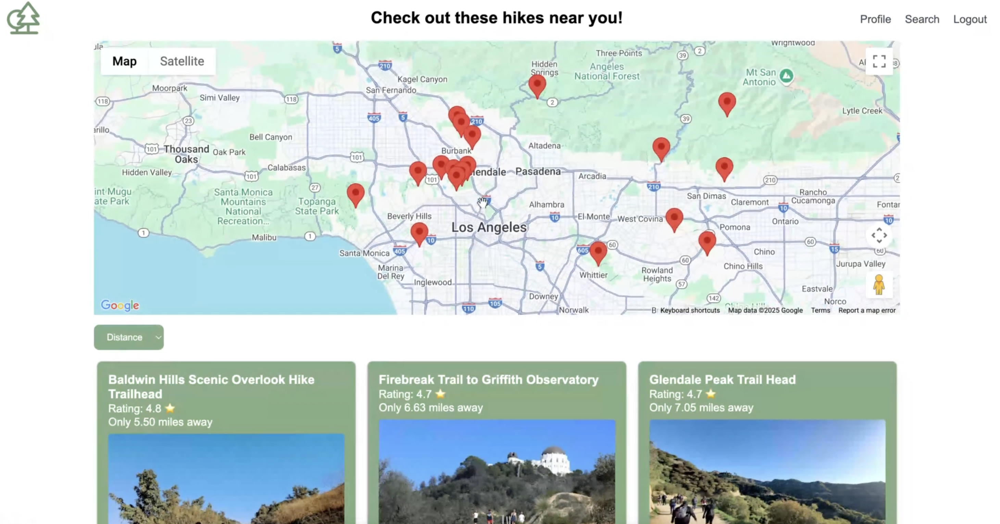
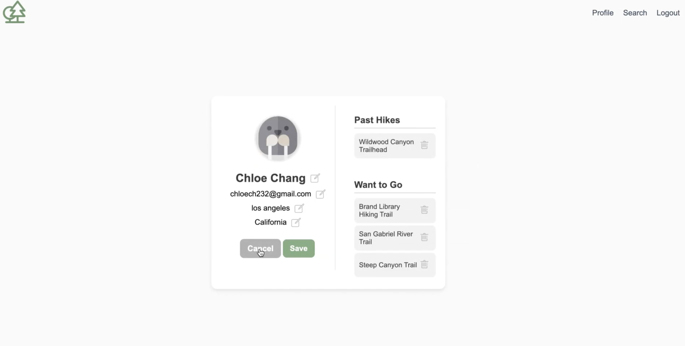

# Summix

## What it does
Our website, Summix, allows hiking enthusiasts to find the best hikes near them quickly and efficiently. The user simply needs to create an account, login, and enter the city and state they live in, and Summix returns a comprehensive list of hikes near them. This list includes the hike’s name, an image of the location, the hike’s rating, and how far (in miles) the hike is from the user’s current location.

## How we built it
We used Next.js and React for the front end, and then we connected the backend using Flask. We utilized Google Maps API to pull data about different hikes in the users area, their ratings, and the users distance from the hike. We built a welcome page, a login/create an account page, and then a page where users can input their preferences, and then the final page that displays all the hikes near them sorted by rating and a map. 


## What's next for summix
We envision Summix being an interface that is tailored to each individual user. We want to find a way to rank the difficulty of each of these hikes, and we want to collect data from the user regarding hikes they have completed or will complete after using Summix. Using this data, we’ll give users hike recommendations based on their skill level. Beyond that, we’d like to make this a social platform, where hikers can share their hiking experiences and hiking “level” with their friends on Summix.


## Getting Started

First, run the development server:

```bash
npm run dev
# or
yarn dev
# or
pnpm dev
# or
bun dev
```

Open [http://localhost:3000](http://localhost:3000) with your browser to see the result. Make sure to run the Flask backend as well to retrieve data from the API.

Demo: 





https://youtu.be/8nCLL-kG2Rs

Deployed the app on Vercel: summix-git-main-chloe-changs-projects.vercel.app

Note: I disabled Google Maps API because it started charging me


